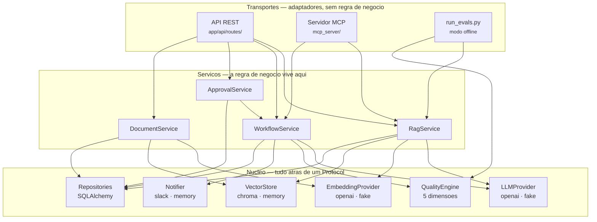
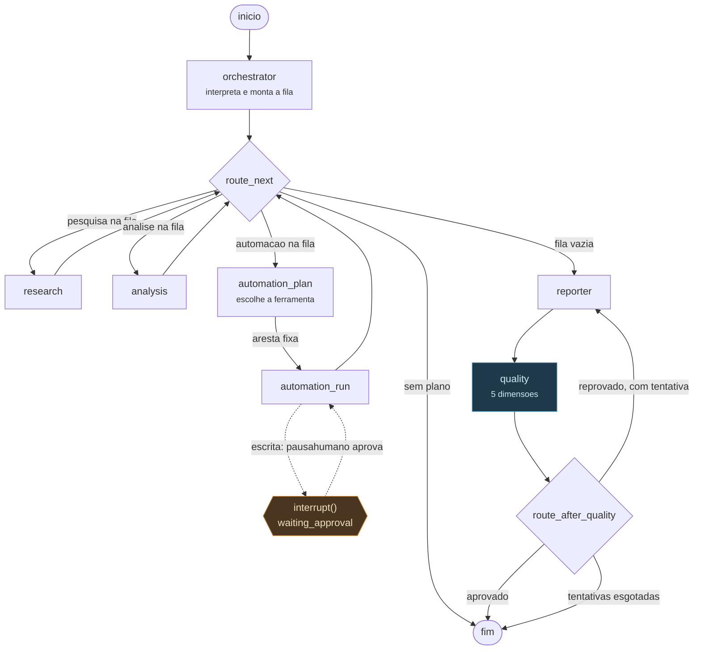
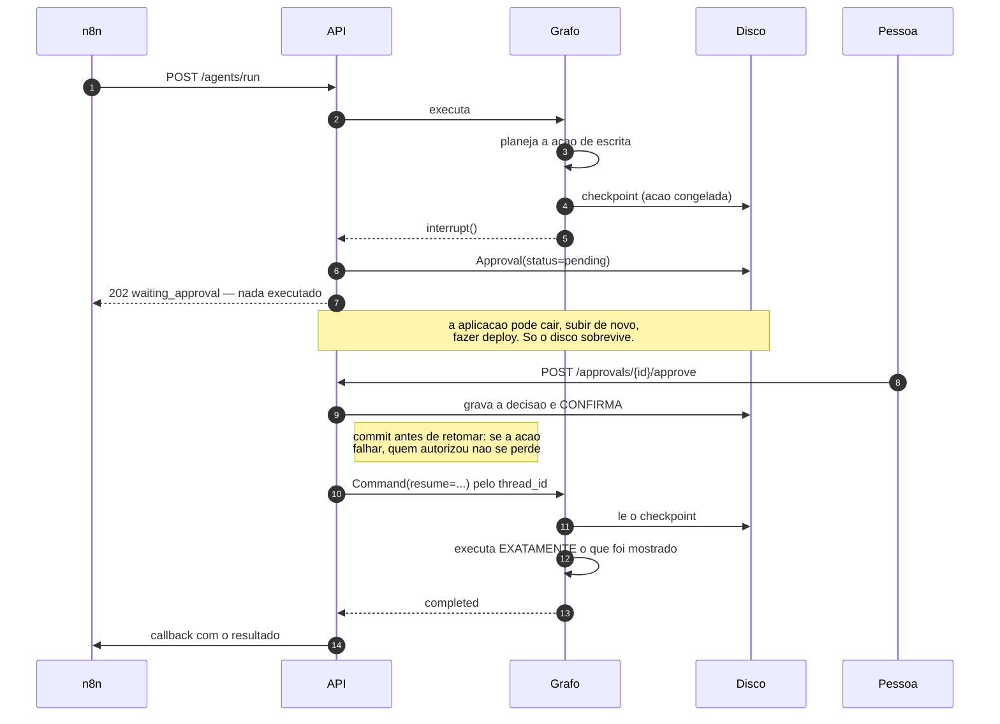
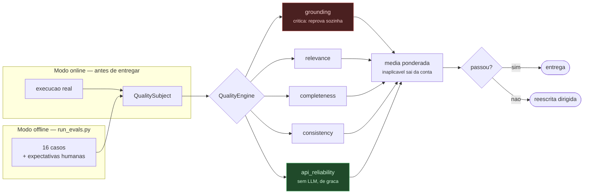
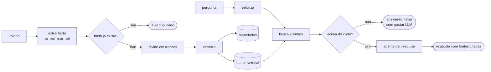
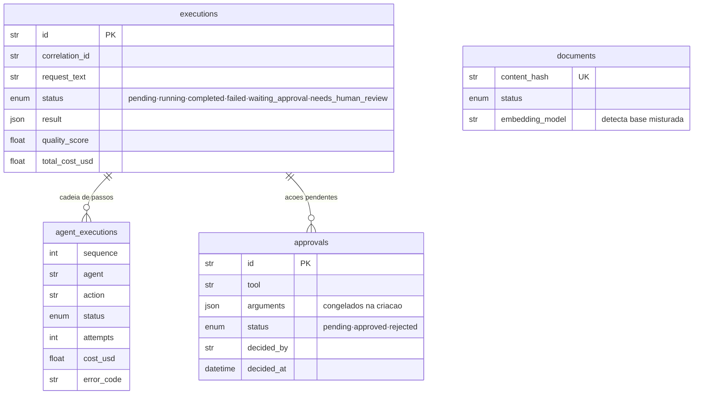

# Arquitetura

Os diagramas sao Mermaid dentro do markdown, e nao imagens. O motivo e o mesmo que fez os
prompts virarem arquivo: diagrama que vive em `.png` sai de sincronia com o codigo na
primeira mudanca e ninguem percebe. Este aparece no diff.

## 1. A forma do sistema

Dois transportes sobre uma camada de servico que nunca soube que HTTP existia.

**O que este desenho garante.** Trocar de provedor de LLM, de banco vetorial ou de canal
de notificacao e trocar uma variavel de ambiente -- cada um tem um Protocol, ao menos duas
implementacoes e um teste de contrato rodando a mesma bateria contra todas.

**O que ele proibe.** Nenhuma seta sobe. Um servico que importasse `fastapi` derrubaria o
servidor MCP junto; foi por isso que o V6 custou menos de 250 linhas.

## 2. O grafo de agentes

O caminho e decidido pelo **plano**, e nao por condicionais no codigo. Cada losango e uma
funcao pura do estado para o nome do proximo no -- testavel em milissegundos, sem provider.

Duas decisoes valem o destaque:

**A automacao ocupa dois nos.** A retomada de um `interrupt()` reexecuta o no **inteiro**.
Se decidir e executar vivessem juntos, cada aprovacao pagaria de novo a chamada de LLM --
e o modelo poderia escolher outra coisa, executando algo diferente do que a pessoa
aprovou. O checkpoint entre os dois congela a acao (ED-052).

**O unico ciclo do grafo e `reporter → quality → reporter`.** Corrigir a redacao e barato
perto de reexecutar pesquisa e analise, e a reprovacao quase sempre e da sintese. O limite
mora no roteador, e nao numa configuracao do LangGraph, para ser testavel como funcao pura
(ED-068).

## 3. Aprovacao humana atravessando um restart

O caso que o V4 existe para resolver: a decisao chega horas depois, e o processo que fez o
pedido nao existe mais.

O teste `tests/integration/test_approval_across_restart.py` derruba aplicacao, engine,
checkpointer e notificador entre os passos 6 e 8. A mensagem sai por um processo que nunca
viu a solicitacao original.

## 4. O motor de qualidade

Um motor, dois modos. O que os une e o `QualitySubject`: uma descricao pobre do que foi
produzido, sem banco, sem HTTP, sem LangGraph.

**As notas nao sao pedidas ao modelo.** O juiz **classifica** -- cada afirmacao como
sustentada ou nao, cada item do pedido como coberto ou nao -- e a aritmetica e nossa. O
ganho e triplo: auditavel, reproduzivel e **testavel** sem rede.

**Dimensao inaplicavel sai da media, nao entra como zero.** Uma recusa correta nao tem
sobre o que ser pertinente; pontuar como zero puniria o comportamento certo.

## 5. Ingestao e recuperacao

**O corte de relevancia nao e o mecanismo de honestidade** -- e um filtro de custo. A
medicao mostrou que perguntas que devem ser recusadas alcancam similaridade **maior**
(0.552) que perguntas que devem ser respondidas (0.477): os grupos se sobrepoem, e nenhum
corte os separa. Quem garante honestidade e o contrato `answered=false` do agente, que le
os trechos e conclui que nao respondem (ED-079).

## 6. Estado da persistencia

Duas tabelas para execucao, e nao uma: um pedido gera varias chamadas de LLM, e achatar
tudo em uma linha destruiria justamente o que da valor -- a cadeia de decisoes, com custo,
latencia e tentativas por etapa. E o que responde *por que a IA concluiu isso?*
